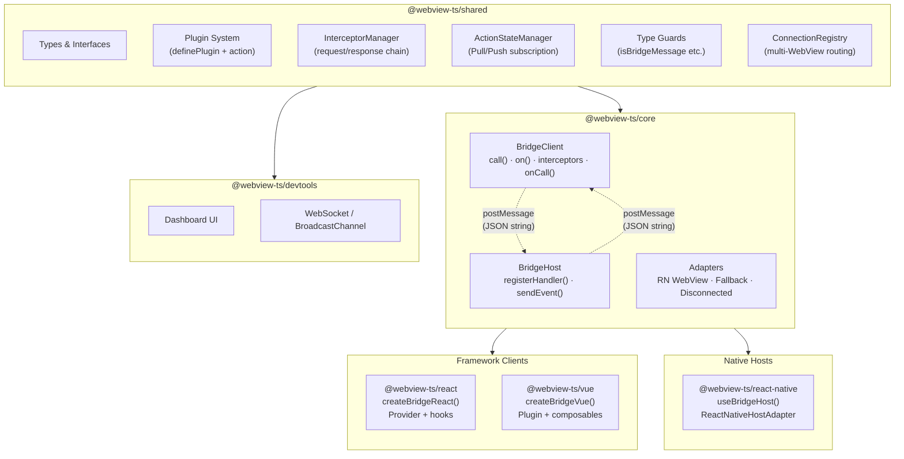

<!-- TODO: banner image (logo + tagline) -->

# webview-ts

**Type-safe WebView &harr; Native bridge for TypeScript**

<!-- TODO: badges (npm, license, CI, coverage) -->

---

## Why?

`postMessage` is the only way WebView and Native talk. But it's just strings &mdash; no types, no request-response matching, no structure.

**webview-ts** turns `postMessage` into typed function calls. Define a plugin once, both sides share the types. The compiler enforces the contract, not documentation.

> *Comlink's problem definition (postMessage abstraction) + Capacitor's plugin architecture + tRPC's end-to-end type inference.*

## How is this different?

| | webview-ts | Manual `postMessage` | [webview-bridge](https://github.com/gronxb/webview-bridge) | [Comlink](https://github.com/GoogleChromeLabs/comlink) | [Capacitor](https://capacitorjs.com) |
|---|---|---|---|---|---|
| Type safety | ✅ contract-first | ❌ strings | ✅ native-first | ✅ proxy-based | ✅ plugin API |
| Source of truth | Neutral plugin file — both sides compile against it | — | Native bridge object — web imports its `typeof` | Exposed object | Plugin definition |
| Browser-only dev | ✅ per-plugin fallback mocks | ❌ | Partial | ❌ | ✅ (web impl) |
| Per-action timeout/retry/cache | ✅ declared in the contract | ❌ | ❌ | ❌ | ❌ |
| RN WebView transport | ✅ | manual | ✅ | ❌ (workers/iframes) | N/A (owns the shell) |
| Scope | Typed transport layer | — | Transport + shared state | Worker RPC | Full app runtime |

The key design difference from webview-bridge: there the **native implementation is the source of truth** (web imports `typeof appBridge`), so native code must exist before web types do. In webview-ts the **contract file is the source of truth** — web and native compile against it independently, which fits teams shipping web and native from separate repos, and lets web development start (with fallback mocks) before any native code exists. If your team co-locates everything in one repo and wants shared state out of the box, webview-bridge is a great choice; webview-ts optimizes for contract-first workflows.

webview-ts is deliberately **not** a Capacitor alternative: it doesn't ship native capabilities (camera, permissions) — it types and structures the transport between *your* web app and *your* native app.

## The Core Idea

One `definePlugin` call is the single source of truth. Payload and response types flow from it to both ends &mdash; the web client's hooks and the native host's handlers &mdash; with zero manual casting:

- **End-to-end Type Safety** &mdash; Define payload and response once, TypeScript infers everywhere.
- **Plugin Architecture** &mdash; Capacitor-inspired. One plugin definition generates typed client hooks and host handlers.
- **Zero Dependencies** &mdash; `@webview-ts/shared` has zero runtime deps. Core is pure TypeScript.

## Batteries Included (all optional)

- **Axios-style Interceptors** &mdash; Transform requests and responses, globally or per-action.
- **Lifecycle Events** &mdash; `onCall('call:start' | 'call:end' | 'call:error')` for logging, timing, and tracing.
- **Fallback Mode** &mdash; Develop in the browser without a native app. Plugins ship their own mock handlers.
- **DevTools** &mdash; Zero-config real-time message inspector. Auto-connects in development.
- **And more** &mdash; per-action timeout/retry/cache, multi-WebView event routing, Vue composables.

## Architecture

<!-- TODO: replace with excalidraw diagram -->



**Dependency rule:** everything depends on `shared`, nothing else is circular. New hosts or clients only need `shared` + `core`.

## Quick Start

### 1. Install

```bash
# Web (React)
pnpm add @webview-ts/react

# Native (React Native)
pnpm add @webview-ts/react-native
```

### 2. Define a Plugin

```typescript
// plugins/camera.ts — shared between web and native
// (also re-exported from @webview-ts/react, @webview-ts/vue, @webview-ts/react-native,
//  so single-package apps never need to import shared directly)
import { action, definePlugin } from '@webview-ts/shared';

interface TakePhotoPayload {
  quality?: number;
}

interface TakePhotoResponse {
  uri: string;
  width: number;
  height: number;
}

export const camera = definePlugin('camera', {
  takePhoto: action<TakePhotoPayload, TakePhotoResponse>(),
}).withFallback({
  // Browser dev without native — returns mock data
  takePhoto: async () => ({
    uri: 'https://picsum.photos/400/300',
    width: 400,
    height: 300,
  }),
});
```

### 3. Set Up the Bridge (Web)

```typescript
// bridge.ts
import { createBridgeReact } from '@webview-ts/react';
import { camera } from './plugins/camera';

export const { BridgeProvider, useBridge, usePlugin } = createBridgeReact({
  plugins: [camera],
});
```

### 4. Use in Components

```tsx
// PhotoButton.tsx
import { camera } from './plugins/camera';
import { usePlugin } from './bridge';

function PhotoButton() {
  const { takePhoto } = usePlugin(camera);

  const handlePress = async () => {
    const result = await takePhoto.execute({ quality: 0.9 });
    //    ^? { uri: string; width: number; height: number }
    console.log('Photo:', result.uri);
  };

  return <button onClick={handlePress}>Take Photo</button>;
}
```

### 5. Handle on Native (React Native)

```tsx
// WebViewScreen.tsx
import { WebView } from 'react-native-webview';
import { useBridgeHost } from '@webview-ts/react-native';
import { camera } from './plugins/camera';

function WebViewScreen() {
  const { webViewProps } = useBridgeHost({
    plugins: [
      camera.host({
        takePhoto: async ({ quality }) => {
          const photo = await NativeCamera.take({ quality });
          return { uri: photo.uri, width: photo.width, height: photo.height };
        },
      }),
    ],
  });

  return <WebView {...webViewProps} source={{ uri: 'https://your-app.com' }} />;
}
```

## Packages

| Package | Description |
|---|---|
| `@webview-ts/shared` | Types, plugin system, interceptor chain, action state, schemas (zero deps) |
| `@webview-ts/core` | BridgeClient + BridgeHost engine |
| `@webview-ts/react` | React hooks &mdash; `createBridgeReact()`, `usePlugin`, `useAction`, `useEvent` |
| `@webview-ts/vue` | Vue composables &mdash; `createBridgeVue()`, `usePlugin`, `useAction`, `useEvent` |
| `@webview-ts/react-native` | React Native host &mdash; `useBridgeHost()`, `ReactNativeHostAdapter` |
| `@webview-ts/devtools` | Real-time message inspector dashboard |

## Platform Support

| Side | Platform | Package | Status |
|---|---|---|---|
| Web (client) | React | `@webview-ts/react` | ✅ Supported |
| Web (client) | Vue 3 | `@webview-ts/vue` | ✅ Supported |
| Web (client) | Browser without native (fallback mode) | `@webview-ts/core` | ✅ Supported |
| Native (host) | React Native WebView | `@webview-ts/react-native` | ✅ Supported |
| Native (host) | iOS WKWebView | &mdash; | 🚧 Planned |
| Native (host) | Android WebView | &mdash; | 🚧 Planned |

New platforms only need to implement the `ClientAdapter` (web side) or `HostAdapter` (native side) interface from `@webview-ts/shared` &mdash; core stays untouched.

## Interceptors

webview-ts uses Axios-style interceptors: sequential transform chains for outgoing requests and incoming responses.

```typescript
import type { RequestInterceptor, ResponseInterceptor } from '@webview-ts/shared';

const logRequest: RequestInterceptor = {
  name: 'log-req',
  fn: (req) => {
    console.log(`[->] ${req.action}`, req.payload);
    return req;
  },
};

const { BridgeProvider, usePlugin } = createBridgeReact({
  plugins: [camera],
  interceptors: { request: [logRequest] },
});
```

**Global vs per-action:**

```typescript
// Global — runs on ALL actions (returns an unsubscribe function)
bridge.interceptors.request.use({ name: 'auth', fn: (req) => req });
bridge.interceptors.response.use({ name: 'unwrap', fn: (res) => res });

// Per-action — attached on the action marker, runs for that action only
const camera = definePlugin('camera', {
  takePhoto: action<P, R>().interceptors.request.use(compressionInterceptor),
});

// Execution order (linear chain):
//   global request → per-action request → [send to host] → per-action response → global response
```

**Lifecycle events** &mdash; for logging and timing, subscribe instead of transforming:

```typescript
bridge.onCall('call:start', ({ action, payload }) => console.log('[->]', action, payload));
bridge.onCall('call:end', ({ action, duration }) => console.log('[<-]', action, `${duration}ms`));
bridge.onCall('call:error', ({ action, error }) => console.error(action, error));
```

The same `onCall` API exists on `BridgeHost` (native side), where the events wrap handler execution &mdash; useful for shipping bridge telemetry to Datadog, Sentry, or any collector from either side.

## DevTools

<!-- TODO: screenshot of DevTools dashboard -->

Zero-config real-time message inspector. Auto-connects to `ws://localhost:4000` in development.

```bash
# Start the DevTools server
pnpm devtools
```

All bridge traffic (requests, responses, events, and call timings) is captured and displayed in a web dashboard. No code changes needed &mdash; just run the server.

## Development

```bash
# Install dependencies
pnpm install

# Build all packages
pnpm build

# Run tests
pnpm test

# Lint fix (all packages + examples)
pnpm lint:fix

# Start dev mode with examples
pnpm dev

# Start DevTools server
pnpm devtools
```

## Contributing

See [CONTRIBUTING.md](./CONTRIBUTING.md) for development setup and commit conventions.

## License

MIT
