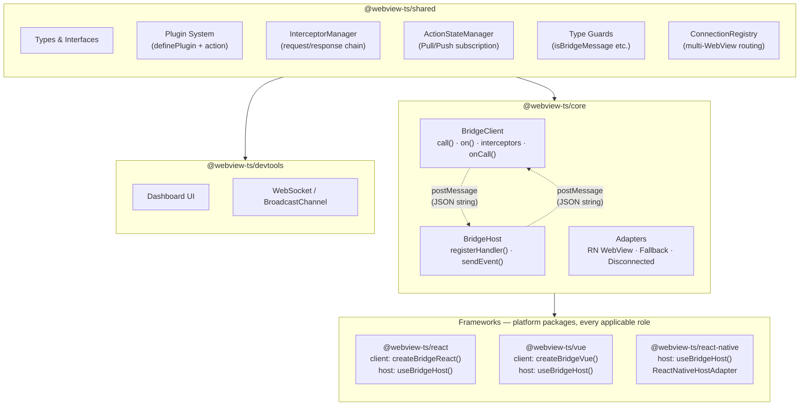

<!-- TODO: banner image (logo + tagline) -->

# webview-ts

**Type-safe WebView &harr; Native bridge for TypeScript**

<!-- TODO: badges (npm, license, CI, coverage) -->

---

## Why?

`postMessage` is the only way WebView and Native talk. But it's just strings — no types, no request-response matching, no runtime guarantees.

**webview-ts** turns `postMessage` into typed, validated function calls. Define a plugin once in a neutral contract file — both sides compile against it, and (optionally) validate against it at runtime.

Built for teams where **web and native live in separate repos**: the native shell team and the web teams share only the contract package. Web development starts before any native code exists (fallback mocks), the compiler enforces the contract across repo boundaries, and schema validation catches version skew — the day your web app ships with a contract the installed native app doesn't have yet.

> _Comlink's problem definition (postMessage abstraction) + Capacitor's plugin architecture + tRPC's end-to-end type inference — plus runtime contract validation neither of them has for WebViews._

## How It works 

_Typed calls from a WebView, captured live in DevTools — native handlers, event streams, and multi-WebView routing._

https://github.com/user-attachments/assets/89ad97b1-ec39-472e-ac49-a0b0de528aa3


## How is this different?

|                                    | webview-ts                                          | [Comlink](https://github.com/GoogleChromeLabs/comlink) | [Capacitor](https://capacitorjs.com) |
| ---------------------------------- | --------------------------------------------------- | ------------------------------------------------------ | ------------------------------------ |
| Type safety                        | ✅ contract-first                                   | ✅ proxy-based                                         | ✅ plugin API                        |
| Source of truth                    | Neutral plugin file — both sides compile against it | Exposed object                                         | Plugin definition                    |
| Browser-only dev                   | ✅ per-plugin fallback mocks                        | ❌                                                     | ✅ (web impl)                        |
| Per-action timeout/retry/cache     | ✅ declared in the contract                         | ❌                                                     | ❌                                   |
| RN WebView transport               | ✅                                                  | ❌ (workers/iframes)                                   | N/A (owns the shell)                 |
| Runtime validation at the boundary | ✅ optional per-action schemas                      | ❌                                                     | ❌                                   |
| Contract export (JSON Schema)      | ✅ `webview-ts schema export`                       | ❌                                                     | ❌                                   |
| Multi-WebView routing              | ✅ target / broadcast via `ConnectionRegistry`      | ❌                                                     | —                                    |
| Scope                              | Typed transport layer                               | Worker RPC                                             | Full app runtime                     |

The defining choice: the **contract file is the source of truth** — web and native compile against it independently, which fits teams shipping web and native from separate repos, and lets web development start (with fallback mocks) before any native code exists.

webview-ts is deliberately **not** a Capacitor alternative: it doesn't ship native capabilities (camera, permissions) — it types and structures the transport between _your_ web app and _your_ native app.

## The Core Idea

One `definePlugin` call is the single source of truth. Payload and response types flow from it to both ends &mdash; the web client's hooks and the native host's handlers &mdash; with zero manual casting:

- **End-to-end Type Safety** &mdash; Define payload and response once, TypeScript infers everywhere.
- **Plugin Architecture** &mdash; Capacitor-inspired. One plugin definition generates typed client hooks and host handlers.
- **Zero Dependencies** &mdash; `@webview-ts/shared` has zero runtime deps. Core is pure TypeScript.

## Batteries Included (all optional)

- **Schema Validation** — Standard Schema (zod/valibot/arktype) at both receiving boundaries, with `.default()`/`.transform()` support.
- **Axios-style Interceptors** &mdash; Transform requests and responses, globally or per-action.
- **Lifecycle Events** &mdash; `onCall('call:start' | 'call:end' | 'call:error')` for logging, timing, and tracing.
- **Fallback Mode** &mdash; Develop in the browser without a native app. Plugins ship their own mock handlers.
- **Multi-WebView Routing** &mdash; one native host, many WebViews: target events to a specific WebView or broadcast to all.
- **DevTools** &mdash; Real-time message inspector. One dev-only import, zero production footprint.
- **And more** &mdash; per-action timeout/retry/cache, Vue composables.

## Architecture

<!-- TODO: replace with excalidraw diagram -->



**Dependency rule:** everything depends on `shared`, nothing else is circular. New hosts or clients only need `shared` + `core`.

## Quick Start

### 1. Install

```bash
# Web (React)
pnpm add @webview-ts/react

# Native (React Native)
pnpm add @webview-ts/react-native
```

### 2. Define a Plugin

```typescript
// plugins/camera.ts — shared between web and native
// (also re-exported from @webview-ts/react, @webview-ts/vue, @webview-ts/react-native,
//  so single-package apps never need to import shared directly)
import { action, definePlugin } from '@webview-ts/shared';

interface TakePhotoPayload {
  quality?: number;
}

interface TakePhotoResponse {
  uri: string;
  width: number;
  height: number;
}

export const camera = definePlugin('camera', {
  takePhoto: action<TakePhotoPayload, TakePhotoResponse>(),
}).withFallback({
  // Browser dev without native — returns mock data
  takePhoto: async () => ({
    uri: 'https://picsum.photos/400/300',
    width: 400,
    height: 300,
  }),
});
```

### 3. Set Up the Bridge (Web)

```typescript
// bridge.ts
import { createBridgeReact } from '@webview-ts/react';
import { camera } from './plugins/camera';

export const { BridgeProvider, useBridge, usePlugin } = createBridgeReact({
  plugins: [camera],
});
```

### 4. Use in Components

```tsx
// PhotoButton.tsx
import { camera } from './plugins/camera';
import { usePlugin } from './bridge';

function PhotoButton() {
  const { takePhoto } = usePlugin(camera);

  const handlePress = async () => {
    const result = await takePhoto.execute({ quality: 0.9 });
    //    ^? { uri: string; width: number; height: number }
    console.log('Photo:', result.uri);
  };

  return <button onClick={handlePress}>Take Photo</button>;
}
```

### 5. Handle on Native (React Native)

```tsx
// WebViewScreen.tsx
import { WebView } from 'react-native-webview';
import { useBridgeHost } from '@webview-ts/react-native';
import { camera } from './plugins/camera';

function WebViewScreen() {
  const { webViewProps } = useBridgeHost({
    plugins: [
      camera.host({
        takePhoto: async ({ quality }) => {
          const photo = await NativeCamera.take({ quality });
          return { uri: photo.uri, width: photo.width, height: photo.height };
        },
      }),
    ],
  });

  return <WebView {...webViewProps} source={{ uri: 'https://your-app.com' }} />;
}
```

## Packages

| Package                    | Description                                                                             |
| -------------------------- | --------------------------------------------------------------------------------------- |
| `@webview-ts/shared`       | Types, plugin system, interceptor chain, action state, schemas (zero deps)              |
| `@webview-ts/core`         | BridgeClient + BridgeHost engine                                                        |
| `@webview-ts/react`        | React — client (`createBridgeReact()`, `usePlugin`, …) **and** host (`useBridgeHost()`) |
| `@webview-ts/vue`          | Vue — client (`createBridgeVue()`, `usePlugin`, …) **and** host (`useBridgeHost()`)     |
| `@webview-ts/react-native` | React Native — host (`useBridgeHost()`, `ReactNativeHostAdapter`)                       |
| `@webview-ts/devtools`     | Real-time message inspector dashboard                                                   |
| `@webview-ts/cli`          | Contract-to-JSON-Schema export CLI                                                      |

## Platform Support

webview-ts targets **TypeScript hosts**: any environment where a JS runtime embeds web content and can pass strings both ways.

Roles are not tied to platforms. **The web is always both**: a web page is a client when something embeds it (a WebView, an iframe) and a host when it embeds others (an iframe shell) — and a page in the middle of a nesting is both at once. Packages are named by platform and export every role that platform supports:

| Platform              | Client                      | Host                                | Package / Example                                           |
| --------------------- | --------------------------- | ----------------------------------- | ----------------------------------------------------------- |
| React (web)           | ✅ `createBridgeReact()`    | ✅ `useBridgeHost()` (iframe shell) | `@webview-ts/react`                                         |
| Vue 3 (web)           | ✅ `createBridgeVue()`      | ✅ `useBridgeHost()` (iframe shell) | `@webview-ts/vue`                                           |
| Vanilla web           | ✅ `BridgeClient` + adapter | ✅ `createBridgeHost()` + adapter   | `@webview-ts/core` ([`examples/iframe`](./examples/iframe)) |
| React Native          | —                           | ✅ `useBridgeHost()`                | `@webview-ts/react-native`                                  |
| NativeScript, Lynx, … | adapter pair per platform   | adapter pair per platform           | Seam ready — contributions welcome                          |

Native Swift/Kotlin SDKs are **not** a target: environments without a JS host are served by the contract instead — `webview-ts schema export` turns your plugins into versioned JSON Schema files (`{ "webviewTs": { "specVersion": 1 } }`) for cross-language codegen and docs.

A new platform is exactly one adapter pair: implement `ClientAdapter` (injected via `BridgeConfig.adapter`) and `HostAdapter` (injected via `createBridgeHost({ adapter })`) &mdash; core stays untouched. The built-in iframe adapters (~40 lines each) are the reference.

## Schema Validation (optional)

Pass any [Standard Schema](https://standardschema.dev) library (zod, valibot, arktype) to `action()` / `event()`. Types are inferred from the schema — no generics needed — and payloads are validated at the **receiving boundary**:

```typescript
import { action, definePlugin, event } from '@webview-ts/shared';
import { z } from 'zod';

export const camera = definePlugin('camera', {
  takePhoto: action({
    payload: z.object({ quality: z.number().min(0).max(1).default(0.8) }),
    response: z.object({ uri: z.string(), width: z.number(), height: z.number() }),
  }),
});
```

- **Host validates inbound payloads** before your handler runs — malformed calls never reach native code.
- **Client validates inbound responses and events** — catches version skew when the installed native app predates your contract.
- **Schema output replaces the value**: `.default()`, `.transform()`, and `z.coerce` work across the bridge. Senders use the schema's input type; receivers get the output type.
- Failures surface as `BridgeCallError` with `code: 'VALIDATION_ERROR'` and structured `details.issues` (message + path). webview-ts never attaches the raw payload to errors — though some schema libraries (e.g. valibot) may include received values in their own issue messages.
- No schema? Nothing changes — phantom-typed `action<P, R>()` works exactly as before.

## Contract Export

```bash
npx @webview-ts/cli schema export ./src/plugins/index.ts -o ./schemas
```

Exports each plugin to a versioned JSON Schema file — the machine-readable form of your contract, ready for codegen, docs, or cross-language validation. Export requires zod (v4); runtime validation works with any Standard Schema library.

## Multi-WebView Routing

Apps that keep several WebViews alive at once — tab bars, main view + modal, mini-app shells — hit the same question fast: _which WebView should receive this event?_ webview-ts answers it with a `ConnectionRegistry`: each WebView registers under its own `sourceId`, responses automatically route back to the WebView that sent the request, and the host can target or broadcast events:

```tsx
import { ConnectionRegistry, TARGET } from '@webview-ts/shared';
import { useBridgeHost } from '@webview-ts/react-native';

const registry = useMemo(() => new ConnectionRegistry(), []);

const hostA = useBridgeHost({ name: 'webview-A', registry, config: { registry }, plugins });
const hostB = useBridgeHost({ name: 'webview-B', registry, config: { registry }, plugins });

// Target one WebView
hostA.bridgeHost.sendEvent('cart.updated', payload, { target: hostB.sourceId });

// Broadcast to every connected WebView
hostA.bridgeHost.sendEvent('session.expired', payload, { target: TARGET.BROADCAST });
```

Routing is host-mediated: WebViews never talk to each other directly — the native host relays every message, which keeps a single audit point for all cross-WebView traffic (interceptors and `onCall` telemetry see everything). See [`examples/react-native`](./examples/react-native) for a two-WebView demo, or [`examples/iframe`](./examples/iframe) for the same routing between two iframes — no native code involved.

## Interceptors

webview-ts uses Axios-style interceptors: sequential transform chains for outgoing requests and incoming responses.

```typescript
import type { RequestInterceptor, ResponseInterceptor } from '@webview-ts/shared';

const logRequest: RequestInterceptor = {
  name: 'log-req',
  fn: (req) => {
    console.log(`[->] ${req.action}`, req.payload);
    return req;
  },
};

const { BridgeProvider, usePlugin } = createBridgeReact({
  plugins: [camera],
  interceptors: { request: [logRequest] },
});
```

**Global vs per-action:**

```typescript
// Global — runs on ALL actions (returns an unsubscribe function)
bridge.interceptors.request.use({ name: 'auth', fn: (req) => req });
bridge.interceptors.response.use({ name: 'unwrap', fn: (res) => res });

// Per-action — attached on the action marker, runs for that action only
const camera = definePlugin('camera', {
  takePhoto: action<P, R>().interceptors.request.use(compressionInterceptor),
});

// Execution order (linear chain):
//   global request → per-action request → [send to host] → per-action response → global response
```

**Lifecycle events** &mdash; for logging and timing, subscribe instead of transforming:

```typescript
bridge.onCall('call:start', ({ action, payload }) => console.log('[->]', action, payload));
bridge.onCall('call:end', ({ action, duration }) => console.log('[<-]', action, `${duration}ms`));
bridge.onCall('call:error', ({ action, error }) => console.error(action, error));
```

The same `onCall` API exists on `BridgeHost` (native side), where the events wrap handler execution &mdash; useful for shipping bridge telemetry to Datadog, Sentry, or any collector from either side.

## DevTools

<!-- TODO: screenshot of DevTools dashboard -->

Real-time message inspector. One import in your dev entry, then run the server:

```typescript
// main.tsx — dev only; registers the recorder and auto-connects to ws://localhost:4000
if (import.meta.env.DEV) {
  import('@webview-ts/devtools/client');
}
```

```bash
# Start the DevTools server
pnpm devtools
```

All bridge traffic (requests, responses, events, and call timings) is captured and displayed in a web dashboard. The recorder lives in a separate package &mdash; production bundles never carry the DevTools runtime.

## Development

```bash
# Install dependencies
pnpm install

# Build all packages
pnpm build

# Run tests
pnpm test

# Lint fix (all packages + examples)
pnpm lint:fix

# Start dev mode with examples
pnpm dev

# Start DevTools server
pnpm devtools
```

## Contributing

See [CONTRIBUTING.md](./CONTRIBUTING.md) for development setup and commit conventions.

## License

MIT
