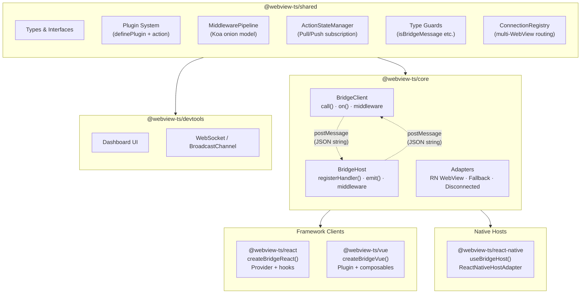

<!-- TODO: banner image (logo + tagline) -->

# webview-ts

**Type-safe WebView &harr; Native bridge for TypeScript**

<!-- TODO: badges (npm, license, CI, coverage) -->

---

## Why?

`postMessage` is the only way WebView and Native talk. But it's just strings &mdash; no types, no request-response matching, no structure.

**webview-ts** turns `postMessage` into typed function calls. Define a plugin once, both sides share the types. The compiler enforces the contract, not documentation.

> *Comlink's problem definition (postMessage abstraction) + Capacitor's plugin architecture + tRPC's end-to-end type inference.*

## Features

- **End-to-end Type Safety** &mdash; Define payload and response once, TypeScript infers everywhere. No manual type casting.
- **Plugin Architecture** &mdash; Capacitor-inspired. One plugin definition generates typed client hooks and host handlers.
- **Koa-style Middleware** &mdash; Onion pipeline shared between web and native. Intercept, transform, short-circuit.
- **Zero Dependencies** &mdash; `@webview-ts/shared` has zero runtime deps. Core is pure TypeScript.
- **Fallback Mode** &mdash; Develop in the browser without a native app. Plugins ship their own mock handlers.
- **DevTools** &mdash; Zero-config real-time message inspector. Auto-connects in development.

## Architecture

<!-- TODO: replace with excalidraw diagram -->



**Dependency rule:** everything depends on `shared`, nothing else is circular. New hosts or clients only need `shared` + `core`.

## Quick Start

### 1. Install

```bash
# Web (React)
pnpm add @webview-ts/core @webview-ts/react @webview-ts/shared

# Native (React Native)
pnpm add @webview-ts/core @webview-ts/react-native @webview-ts/shared
```

### 2. Define a Plugin

```typescript
// plugins/camera.ts — shared between web and native
import { action, definePlugin } from '@webview-ts/shared';

interface TakePhotoPayload {
  quality?: number;
}

interface TakePhotoResponse {
  uri: string;
  width: number;
  height: number;
}

export const camera = definePlugin('camera', {
  takePhoto: action<TakePhotoPayload, TakePhotoResponse>(),
}).withFallback({
  // Browser dev without native — returns mock data
  takePhoto: async () => ({
    uri: 'https://picsum.photos/400/300',
    width: 400,
    height: 300,
  }),
});
```

### 3. Set Up the Bridge (Web)

```typescript
// bridge.ts
import { createBridgeReact } from '@webview-ts/react';
import { camera } from './plugins/camera';

export const { BridgeProvider, useBridge, usePlugin } = createBridgeReact({
  plugins: [camera],
});
```

### 4. Use in Components

```tsx
// PhotoButton.tsx
import { camera } from './plugins/camera';
import { usePlugin } from './bridge';

function PhotoButton() {
  const { takePhoto } = usePlugin(camera);

  const handlePress = async () => {
    const result = await takePhoto.execute({ quality: 0.9 });
    //    ^? { uri: string; width: number; height: number }
    console.log('Photo:', result.uri);
  };

  return <button onClick={handlePress}>Take Photo</button>;
}
```

### 5. Handle on Native (React Native)

```tsx
// WebViewScreen.tsx
import { WebView } from 'react-native-webview';
import { useBridgeHost } from '@webview-ts/react-native';
import { camera } from './plugins/camera';

function WebViewScreen() {
  const { webViewProps } = useBridgeHost({
    plugins: [
      camera.host({
        takePhoto: async ({ quality }) => {
          const photo = await NativeCamera.take({ quality });
          return { uri: photo.uri, width: photo.width, height: photo.height };
        },
      }),
    ],
  });

  return <WebView {...webViewProps} source={{ uri: 'https://your-app.com' }} />;
}
```

## Packages

| Package | Description |
|---|---|
| `@webview-ts/shared` | Types, plugin system, middleware pipeline, schemas (zero deps) |
| `@webview-ts/core` | BridgeClient + BridgeHost engine |
| `@webview-ts/react` | React hooks &mdash; `createBridgeReact()`, `usePlugin`, `useAction`, `useEvent` |
| `@webview-ts/vue` | Vue composables &mdash; `createBridgeVue()`, `usePlugin`, `useAction`, `useEvent` |
| `@webview-ts/react-native` | React Native host &mdash; `useBridgeHost()`, `ReactNativeHostAdapter` |
| `@webview-ts/devtools` | Real-time message inspector dashboard |

## Middleware

webview-ts uses a Koa-style onion middleware pipeline. The same pipeline runs on both web and native sides.

```typescript
import type { Middleware } from '@webview-ts/shared';

// Global middleware — runs on every action
const logger: Middleware = {
  name: 'logger',
  fn: async (ctx, next) => {
    console.log(`[->] ${ctx.request.action}`, ctx.request.payload);
    await next();
    console.log(`[<-] ${ctx.request.action}`, ctx.response?.data);
  },
};

const { BridgeProvider, usePlugin } = createBridgeReact({
  plugins: [camera],
  middleware: [logger],
});
```

**Global vs Plugin Interceptor:**

```typescript
// Global — runs on ALL actions
bridge.use(authMiddleware);

// Plugin interceptor — runs on ONE action only
const camera = definePlugin('camera', {
  takePhoto: action<P, R>()
    .use(compressionInterceptor),  // only for takePhoto
});

// Execution order (onion):
//   Global[0] → Global[1] → Plugin Interceptor → [core] → Plugin → Global[1] → Global[0]
```

## DevTools

<!-- TODO: screenshot of DevTools dashboard -->

Zero-config real-time message inspector. Auto-connects to `ws://localhost:4000` in development.

```bash
# Start the DevTools server
pnpm devtools
```

All bridge traffic (requests, responses, events, middleware traces) is captured and displayed in a web dashboard. No code changes needed &mdash; just run the server.

## Development

```bash
# Install dependencies
pnpm install

# Build all packages
pnpm build

# Run tests
pnpm test

# Lint fix (all packages + examples)
pnpm lint:fix

# Start dev mode with examples
pnpm dev

# Start DevTools server
pnpm devtools
```

## Contributing

See [CONTRIBUTING.md](./CONTRIBUTING.md) for development setup and commit conventions.

## License

MIT
