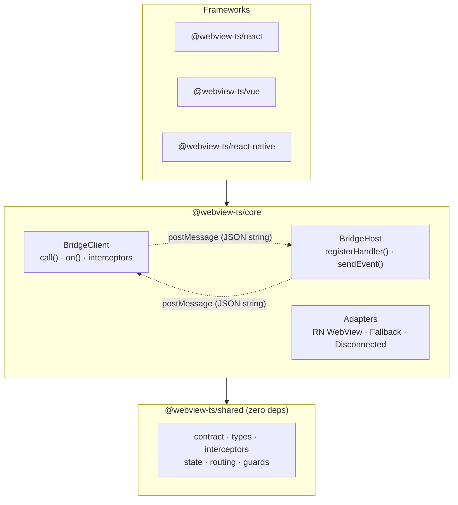

# Architecture

Everything crossing the boundary is a JSON string. webview-ts is the layers on both sides of that string.

## The layers



**The dependency rule: arrows point down, only.**

| Layer                                       | Rule                                                                                            | Enforced by                     |
| ------------------------------------------- | ----------------------------------------------------------------------------------------------- | ------------------------------- |
| `shared`                                    | Imports nothing — no packages, no frameworks                                                    | package.json (zero deps) + lint |
| `core`                                      | Knows only `shared`. Never imports a framework                                                  | lint boundary rules             |
| frameworks (`react`, `vue`, `react-native`) | Thin wrappers over core, exporting every role the platform supports (web = client **and** host) | lint boundary rules             |
| `devtools`, `cli`                           | Sidecars — observe through seams, know only `shared`                                            | lint boundary rules             |

A layering violation fails `eslint` before it ever compiles.

## Anatomy of a call

```
web                                   │ string │                              host
──────────────────────────────────────┼────────┼──────────────────────────────────
execute(payload)                      │        │
  → request interceptors              │        │
  → message id issued, callback kept  │  JSON  │
  → adapter.send ─────────────────────┼───────▶│ adapter.onMessage
                                      │        │  → parse + type guard
                                      │        │  → payload schema validation
                                      │        │  → your handler runs
                                      │        │  → response serialized
adapter.onMessage ◀───────────────────┼────────┤    (never includes stack traces)
  → id matched, callback resolved     │  JSON  │
  → response schema validation        │        │
  → response interceptors             │        │
promise resolves, fully typed         │        │
```

Types exist only on the two sides. Inside the string boundary, the only trust anchors are the **contract** (schemas) and the **message id** (cryptographically random, so responses can't be forged by guessing).

## Adapters own the transport

Reception and sending are both part of the adapter interface — the engine never touches a platform API:

- `ClientAdapter` — `send(message)` + `onMessage(cb)`. Injected via `BridgeConfig.adapter`, or auto-detected (React Native WebView).
- `HostAdapter` — `send(json)` + `onMessage(cb)`. Injected via `createBridgeHost({ adapter })` (or `BridgeHost.attach()` at the lower level).

This is why platform quirks stay contained. Example: react-native-webview delivers host→web messages on `window` on iOS but on `document` on Android (with `bubbles: false`, so it never reaches `window`) — the RN client adapter listens on both, and no other layer knows.

A new platform is exactly one adapter pair. See [Custom adapters](../platforms/custom-adapters).

## State layer

`ActionStateManager` (in `shared`) is a framework-agnostic async state machine for one action: `status`, `data`, `error`, `isLoading`, with both pull (`subscribe`/`getSnapshot`, for React's `useSyncExternalStore`) and push (`watch`, for Vue/Svelte/Solid) subscription models. The React and Vue bindings are thin wrappers over it — a new framework binding is a subscription file, not a rewrite.

Caching lives in `ActionCache`, owned per action by `BridgeClient` and shared by every component using that action — see [Timeout, retry & cache](../guides/timeout-retry-cache).
