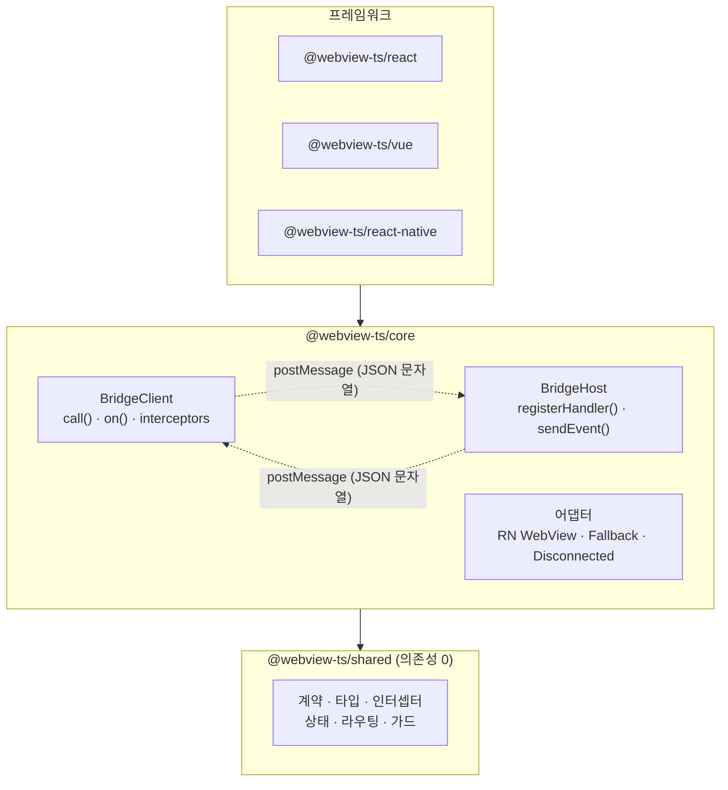

# 아키텍처

경계를 건너는 건 전부 JSON 문자열입니다. webview-ts는 그 문자열 양쪽에 쌓인 계층들입니다.

## 계층



**의존 규칙: 화살표는 아래로만 향합니다.**

| 계층                                        | 규칙                                                                                                   | 지키는 수단                   |
| ------------------------------------------- | ------------------------------------------------------------------------------------------------------ | ----------------------------- |
| `shared`                                    | 아무것도 import하지 않음 — 패키지도, 프레임워크도                                                      | package.json(의존성 0) + lint |
| `core`                                      | `shared`만 안다. 프레임워크 import 금지                                                                | lint 경계 룰                  |
| 프레임워크 (`react`, `vue`, `react-native`) | core를 감싼 얇은 래퍼. 그 플랫폼이 맡을 수 있는 역할을 전부 export (웹 = 클라이언트 **그리고** 호스트) | lint 경계 룰                  |
| `devtools`, `cli`                           | 사이드카 — 시임으로만 관찰, `shared`만 안다                                                            | lint 경계 룰                  |

계층 위반은 컴파일되기도 전에 `eslint`에서 실패합니다.

## 호출 한 번의 해부

```
웹                                    │ 문자열 │                            호스트
──────────────────────────────────────┼────────┼──────────────────────────────────
execute(payload)                      │        │
  → 요청 인터셉터                     │        │
  → 메시지 id 발급, 콜백 보관         │  JSON  │
  → adapter.send ─────────────────────┼───────▶│ adapter.onMessage
                                      │        │  → 파싱 + 타입 가드
                                      │        │  → 페이로드 스키마 검증
                                      │        │  → 핸들러 실행
                                      │        │  → 응답 직렬화
adapter.onMessage ◀───────────────────┼────────┤    (스택 트레이스 미포함)
  → id 매칭, 콜백 resolve             │  JSON  │
  → 응답 스키마 검증                  │        │
  → 응답 인터셉터                     │        │
프로미스가 완전한 타입으로 resolve    │        │
```

타입은 양쪽 끝에서만 존재합니다. 문자열 경계 안에서 믿을 건 **계약**(스키마)과 **메시지 id**(암호학적 난수라 응답을 위조하려면 id를 맞혀야 함) 둘뿐입니다.

## 어댑터가 전송을 소유한다

수신과 송신 모두 어댑터 인터페이스의 일부이고, 엔진은 플랫폼 API를 만지지 않습니다:

- `ClientAdapter` — `send(message)` + `onMessage(cb)`. `BridgeConfig.adapter`로 주입하거나 자동 감지(React Native WebView).
- `HostAdapter` — `send(json)` + `onMessage(cb)`. `createBridgeHost({ adapter })`로 주입 (더 낮은 레벨에서는 `BridgeHost.attach()`).

플랫폼 특이사항이 밖으로 새지 않는 이유가 여기 있습니다. 예를 들어 react-native-webview는 호스트→웹 메시지를 iOS에서는 `window`로, Android에서는 `document`로 보냅니다(`bubbles: false`라 window까지 올라오지 않음). RN 클라이언트 어댑터가 양쪽을 다 듣고, 다른 계층은 이 사실을 모릅니다.

새 플랫폼의 비용은 정확히 어댑터 한 쌍입니다. [커스텀 어댑터](../platforms/custom-adapters)를 참고하세요.

## 상태 계층

`ActionStateManager`(`shared` 소속)는 액션 하나를 담당하는, 프레임워크와 무관한 비동기 상태 기계입니다. `status`, `data`, `error`, `isLoading`을 풀 모델(`subscribe`/`getSnapshot` — React `useSyncExternalStore`용)과 푸시 모델(`watch` — Vue/Svelte/Solid용) 두 가지로 노출합니다. React·Vue 바인딩은 이 위의 얇은 래퍼일 뿐이라, 새 프레임워크 바인딩을 만드는 일은 재작성이 아니라 구독 파일 하나를 쓰는 일입니다.

캐시는 `ActionCache`에 삽니다. `BridgeClient`가 액션당 하나씩 소유하고, 그 액션을 쓰는 모든 컴포넌트가 나눠 씁니다 — [Timeout, Retry & Cache](../guides/timeout-retry-cache)를 참고하세요.
